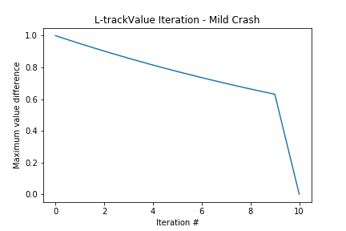
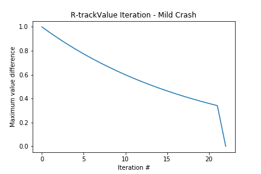

# Reinforcement-Learning-Racetrack-Problem

## Abstract

In this project, two algorithms – Value Iteration and Q-Learning – are experimented to solve a reinforcement learning problem where we want to train a race car to get from the starting line to the finish line on a racetrack in a minimum amount of time. We assess the convergence time and how a test car performs with models that use different racetracks and different crash scenarios.

## Introduction

In this project, each algorithm is trained with two racetracks – “L-track” and “R-track”. “L-track” has a size of 11x37. The track consists of two straight lines combining to an “L” shape. Compared to “L-track”, the “R-track” has a more irregular shape (“R” shape) and a larger size (28x30). Also, each model deals with two crash scenarios – mild crash and harsh crash. In case of a mild crash, when the car runs into a wall, it is reset to the nearest position on the track. In case of a harsh crash, it is reset to the starting position when it crashes. In both cases, the velocity of the car is set to [0, 0].  Note that in this experiment, [x position, y position, x velocity, y velocity] defines the state and [x acceleration, y acceleration] defines an action. Velocity can only be in the range [-5, 5]. Acceleration in each direction can only be -1, 0, or 1.

> Value Iteration is a model-based learning algorithm where we have full knowledge about the environmental parameters. We can implement Value Iteration in this project because we completely know the reward and the next state of each state-action pair. During each training iteration, the Q value of each state-action pair is updated, which is then used to update value of each state in the V table and policy for each state in the P table. After each update, we assess the maximum value difference between the current iteration and the previous iteration. If this difference is less than a predefined threshold, then we say that the values converge and stop training. I expect Value Iteration to spend more iterations before convergence for “R-track” because there are more states to be considered in “R-track”. Regarding the crash scenarios, I expect training and testing to be the same for both crash scenarios because we already have knowledge about the walls and would avoid them in both cases.

> On the other hand, Q-Learning is a model-free learning algorithm where we assume that we do not have much knowledge about the environment. During training, a car continues to explore the environment to query the model. Each query updates the Q value of each state-action pair. Training converges when a predefined number of iterations is reached. Because the lack of knowledge about the environment, I expect Q-Learning to have slower training time than Value Iteration. Since the convergence criterion is set arbitrarily and does not guarantee that the policy converges to the optimal one, I expect the test car to take more steps before finding the finish line when compared to Value Iteration. In order to acquire a good estimate for each state-action pair, a Q-Learning model should run through the track multiple times. It is more difficult for a training car to run through the track if the track is relatively complicated or if the car keeps getting reset to the starting line. Thus, I expect Q-Learning to take more steps in both training and testing process for “R-track” and the harsh crash scenario.  

Methods

- Racetrack and race car:

  In the beginning of each race, a race car is initialized at a random position of the starting line with initial velocity [0, 0]. Each time a new acceleration is applied, the velocity is updated first using the new acceleration and then the car is moved a certain distance based on the new velocity. A race car is defined to be finished when it lands directly on or passes the finish line.

- Value Iteration [1]:

  Discount factors in the list [0.65, 0.75, 0.85, 0.95] were tested using a small test track. All values work fine on the test track, and 0.95 is selected because I want the rewards further in the future to be counted more when using a larger track. The convergence threshold of the maximum value difference is set to 0.1. Three tables – Q table, value table, and policy table – are maintained and updated in each iteration. After the model is trained, a test car simply follows policy for each state in the policy table to perform corresponding acceleration.

- Q-Learning [2]:

  Several combinations of discount factor, learning rate, and exploration factor (epsilon) were tested using a small test track. The combination that leads to the best result on average has discount factor 0.95, learning rate 0.5, and epsilon 0.3. However, I found that it takes a large amount of training time using this combination on larger tracks. Thus, I increase the learning rate to 0.75 and epsilon to 0.5, and add a decay coefficient for both so that the models learn fast and explore more at the beginning, but gradually stabilize towards the end. This speeds up training. 

  For “L-track”, the model can converge with 10000 maximum iterations and 1000 maximum steps in each iteration. For “R-track”, however, 1000 maximum steps are insufficient. Thus, 10000 maximum iterations and 10000 maximum steps in each iteration are set for “R-track”. Note that there is a 20% chance that an attempt to accelerate would fail and the velocity would remain unchanged at the next step. This increases the number of steps the race car needs to take before finding the finish line during training. After the model is trained, a test car follows the Q value of each state-action pair to perform corresponding acceleration.

## Results

- Learning curves:

   
   

  fig.1 The learning curve for Value Iteration using different racetracks and crash scenarios.

   
   

  fig.2 The learning curve for Q-Learning using different racetracks and crash scenarios. Note that “L-track” uses a maximum of 1000 steps during each training iteration while “R-track” uses a maximum of 10000 steps during each training iteration.

- Test results:

  

  table.1 Each number shown in the table is the average number of steps a test car needs to take before finding the finish line using each trained model: For each model, 10 test cars are experimented.

## References

1. Wei, Q., Liu, D., & Lin, H. (2016). Value iteration adaptive dynamic programming for optimal control of discrete-time nonlinear systems. IEEE Transactions on cybernetics, 46(3), 840-853.
2. Even-Dar, E., & Mansour, Y. (2003). Learning rates for Q-learning. Journal of Machine Learning Research, 5(Dec), 1-25.
3. Archibald, T. W., Sassen, S. A. E., & Thomas, L. C. (1997). An optimal policy for a two depot inventory problem with stock transfer. Management Science, 43(2), 173-183.
